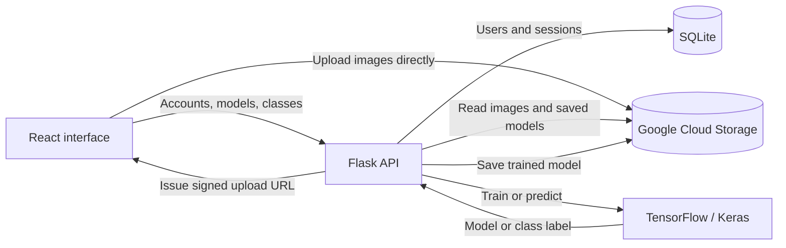

<p align="center">
  <strong>A browser-based workspace for building custom image classifiers.</strong><br>
  Organize labeled images, train a neural network, and try predictions in one workflow.
</p>

<p align="center">
  <a href="#what-you-can-do">Features</a> ·
  <a href="#how-it-works">How it works</a> ·
  <a href="#run-locally">Run locally</a> ·
  <a href="#roadmap">Roadmap</a>
</p>

---

## Why LabelLens?

Experimenting with image classification involves more than training a model: you need to organize examples, assign labels, and test the result. LabelLens brings those steps into a React interface backed by Flask, TensorFlow, and Google Cloud Storage.

For example, create a **Flowers** model, add **Daisy**, **Rose**, and **Sunflower** classes, upload your examples, and train a classifier. Then upload a new flower image to see its predicted class.

**Project status:** a prototype for learning and experimentation. Cloud configuration is required, and authentication and training reliability need further work before public production use. See [current limitations](#current-limitations).

## What you can do

| Step | Implemented functionality |
| --- | --- |
| **Organize** | Create and delete models; add and remove image classes within each model. |
| **Upload** | Upload multiple images per class through signed Google Cloud Storage URLs. |
| **Train** | Trigger training of a custom convolutional neural network and save the resulting `.keras` model in cloud storage. |
| **Predict** | Upload a new image and receive a predicted class label. |
| **Manage** | Sign up, log in, and access model storage organized by user ID. |

## How it works

1. **Create a model** from the dashboard.
2. **Add classes** representing the labels you want to recognize.
3. **Upload examples** for each class. Use JPG or PNG images for the clearest path through the current upload and counting logic.
4. **Select Generate** to train the model.
5. **Select Predict** and upload an image to classify it.

Use at least two classes and a varied collection of images per class for a meaningful experiment. The API rejects classes with fewer than two uploaded objects, but that minimum is not a guarantee of a valid training split or useful accuracy. Keep some images separate for testing.



### Built with

| Layer | Technology |
| --- | --- |
| Interface | React 18, React Router, PrimeReact, PrimeFlex |
| Frontend tooling | Vite 7; Tailwind CSS plugin configured |
| API | Python, Flask, Flask-CORS |
| Machine learning | TensorFlow 2.20, Keras, NumPy, Pillow |
| Image and model storage | Google Cloud Storage |
| Account and session storage | SQLite |

### Training at a glance

- **Input:** images resized to 128 × 128 pixels, with aspect-ratio padding during training.
- **Architecture:** four convolutional blocks with batch normalization and max pooling, followed by dense layers and dropout.
- **Augmentation:** random horizontal flips, rotation, zoom, and brightness changes.
- **Training split:** 70% training / 30% validation with a fixed split seed.
- **Current defaults:** one epoch, batch size 32, Adam optimizer with learning rate `0.0005`.
- **Output:** a `.keras` model; the prediction API returns the selected class label.

Accuracy depends on the dataset and training configuration. The repository does not include published benchmark results.

## Run locally

The current code requires a Google Cloud Storage bucket and a service-account key. It also contains hardcoded service locations that must be changed for your environment; setting environment variables alone does not configure this version.

### 1. Get the project

```bash
git clone https://github.com/Mushium/LabelLens.git
cd LabelLens
```

You will need:

- Node.js compatible with the locked Vite tooling: `^20.19.0 || >=22.12.0`, plus npm.
- Python with `pip` and `venv`, on a platform supported by the pinned TensorFlow package.
- A Google Cloud Storage bucket and a service account permitted to read bucket metadata and list, read, write, and delete its objects.

### 2. Configure cloud storage

1. Put your service-account JSON key at `backend/storage_key.json`. This path is already excluded by `.gitignore`; keep credentials out of Git.
2. In `backend/app.py`, replace the bucket name in `storage_client.get_bucket(...)` with your own bucket name.
3. Configure the bucket's CORS rules to allow `PUT` uploads from your frontend origin, with the `Content-Type` header. For the local commands below, that origin is `http://localhost:5173`. See Google's [CORS configuration examples](https://docs.cloud.google.com/storage/docs/cors-configurations) and [setup instructions](https://docs.cloud.google.com/storage/docs/using-cors).

### 3. Start the backend

Run these commands from the repository root:

```bash
cd backend
python3 -m venv .venv
source .venv/bin/activate
python -m pip install -r requirements.txt
python app.py
```

On Windows PowerShell, activate the environment with `.venv\Scripts\Activate.ps1` instead.

Run the backend from its `backend` directory: the credential and SQLite file paths are relative to the working directory. Flask starts at `http://127.0.0.1:5000`; its root endpoint returns `Started` once startup succeeds.

### 4. Point the frontend at your backend

Replace `https://labellens.onrender.com` with `http://127.0.0.1:5000` in these files:

- `frontend/src/Pages/account.jsx`
- `frontend/src/Pages/dashboard.jsx`
- `frontend/src/Pages/model.jsx`

These are source changes required by the current implementation. A shared API client with an environment-based URL is a planned improvement.

### 5. Start the frontend

In a second terminal, from the repository root:

```bash
cd frontend
npm ci
npm run dev -- --port 5173 --strictPort
```

Open `http://localhost:5173`, sign up, and create your first model. Using a fixed port keeps the browser origin consistent with the bucket CORS configuration.

To build the frontend:

```bash
npm run build
```

Vite writes the build to `frontend/dist`. The Flask service and Google Cloud Storage configuration are still required for application features.

## Project structure

```text
LabelLens/
├── backend/
│   ├── app.py                 # Flask routes and cloud-storage integration
│   ├── easy_model.py          # CNN training and image prediction
│   ├── easy_user.py           # SQLite account and session helpers
│   └── requirements.txt       # Pinned Python dependencies
├── docs/
│   └── readme-banner.svg      # Repository cover artwork
├── frontend/
│   ├── public/                # Branding assets and redirect configuration
│   ├── src/
│   │   ├── Pages/             # Home, account, dashboard, model, settings
│   │   ├── components/        # Shared page layout
│   │   └── main.jsx           # App entry point and routes
│   ├── package.json
│   └── vite.config.js
└── README.md
```

<details>
<summary><strong>API overview</strong></summary>

Authenticated routes use the custom `authkey` request header.

| Method | Endpoint | Purpose |
| --- | --- | --- |
| `POST` / `GET` | `/user` | Create an account / log in |
| `GET` | `/auth` | Check a session token |
| `GET` | `/key` | Remove the supplied session token |
| `GET` / `POST` / `DELETE` | `/models` | List, create, or delete models |
| `GET` / `POST` / `DELETE` | `/classes` | List, create, or delete classes |
| `POST` | `/signed-upload-url` | Request a signed URL for an image upload |
| `POST` | `/generate` | Train and store a model |
| `POST` | `/predict` | Classify an uploaded image |

The current API mixes headers, JSON, and multipart form data for inputs. See `backend/app.py` for the request format of each route.

</details>

## Current limitations

- **Authentication:** passwords are stored as plaintext in SQLite. Session tokens expire after 30 minutes, and the backend clears stored tokens at startup. Password hashing and stronger session handling are needed before inviting public users.
- **Training:** training runs synchronously inside the HTTP request, with a single epoch and no progress reporting or saved evaluation report.
- **Prediction consistency:** class names are rediscovered from storage instead of saved with the trained model. Training pads image aspect ratios, while prediction uses a direct resize. Both paths should share preprocessing and a saved class mapping.
- **Configuration:** the API URL, bucket name, and credential path are hardcoded. The project has no bundled sample dataset or offline demo mode.
- **Interface:** settings are a placeholder; predictions use browser alerts, and several actions reload the page.

## Roadmap

- [ ] Add a short walkthrough and screenshots of the dashboard, class uploads, and prediction result.
- [ ] Unify the app name, favicon, navigation, and responsive layouts.
- [ ] Centralize configuration and provide a documented `.env.example`.
- [ ] Hash passwords and improve session and input handling.
- [ ] Save class labels with each model and share image preprocessing between training and prediction.
- [ ] Add background training jobs, progress feedback, and evaluation results.
- [ ] Show prediction results and confidence in an accessible result panel.
- [ ] Add a small redistributable example dataset and automated checks.

## Feedback

Found a bug or have an idea? [Open an issue](https://github.com/Mushium/LabelLens/issues) with the steps to reproduce it or a description of the proposed improvement.
